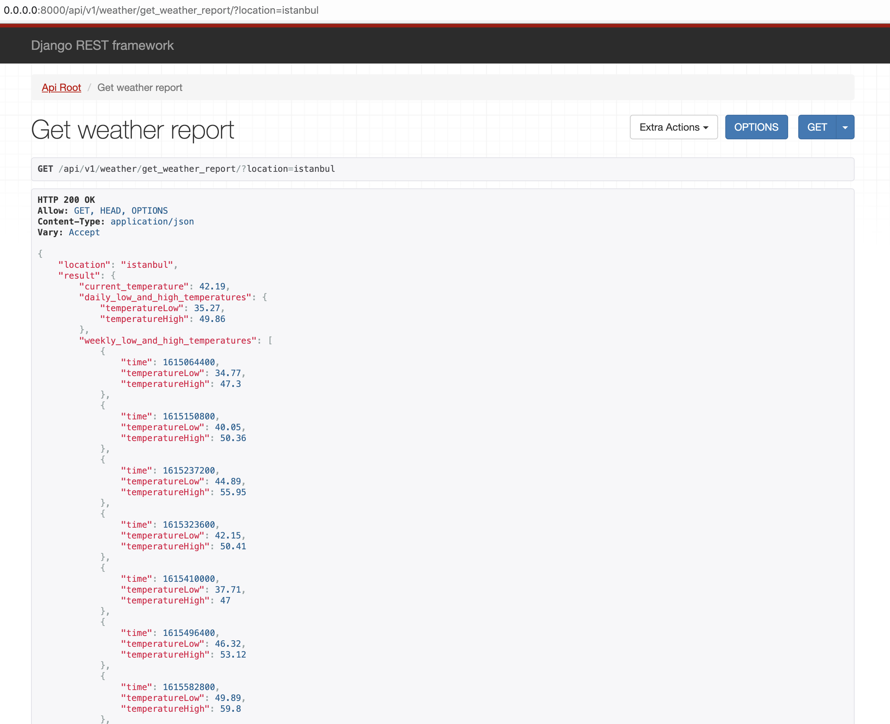

# Weather Forecast Service


The project is an simple API service that helps you to search and get weather information by given location.


## Installation
The project uses **Django**, **DRF** etc. and **PostgreSQL** for database and **.env** file for configuration.

First of all, please create a configuration file under `weather/` as following `.env`
or copy example file as `cp weather/.env.example weather/.env` 

```
ALLOWED_HOSTS=127.0.0.1,localhost,0.0.0.0
DEBUG=on
DB_NAME=weather
DB_USER=postgres
DB_PASSWORD=postgres
DB_HOST=db
DB_PORT=5432
LOCATIONIQ_API_URL=https://eu1.locationiq.com/v1/
LOCATIONIQ_TOKEN=a1779b7817b3b2
DARKSKY_API_URL=https://api.darksky.net/
DARKSKY_TOKEN=f3146e0fc78b4930d41a60703c08e2ae
```

```
docker-compose up --build
```
Create database named `weather` on PostgreSQL container as following.
```
docker-compose run --rm db bash
createdb weather -U postgres -W postgres
```

After built project then please also apply migrations
on another terminal session by following commands. 
```
docker exec -it app bash
python manage.py migrate
```

Then visit `http://0.0.0.0:8000/api/v1/weather/get_weather_report/?location=istanbul`


## Endpoints
There are several actions for get related data as following.

| Method | URI                               |  Description                                                 |
|--------|-----------------------------------|--------------------------------------------------------------|
| GET    | /api/v1/weather/get_weather_report/?location={location} | It is used to get result of weather info by `location` query parameter.  |
